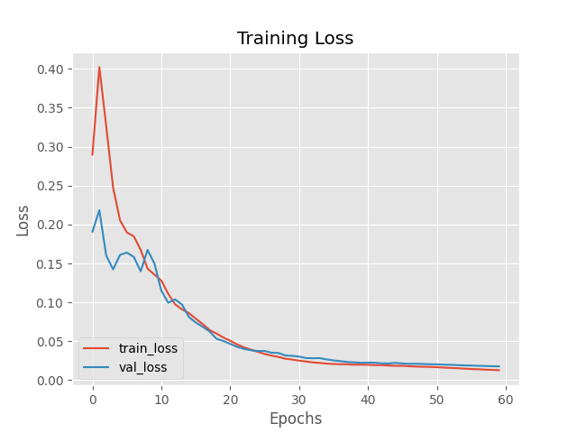
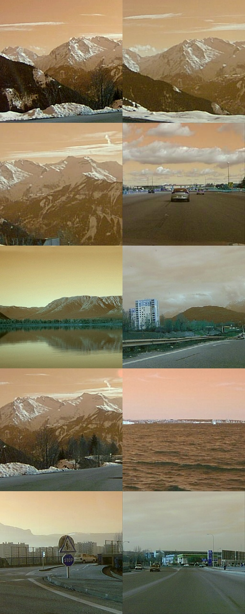

[8 Scenes dataset]:
https://people.csail.mit.edu/torralba/code/spatialenvelope/

## Autoencoder for Image Retrieval

Example project of building a CBIR to learn a compressed representation of a given dataset and using the compressed representation to build an image database for query and retrieval.

### Dataset

We use the [8 Scenes dataset] from "Modeling the shape of the scene: a holistic representation of the spatial envelope".

The dataset comprises of a total of 2689 images from 8 different scene categories. Each image is already resized to 256x256 and in RGB format.

### Data preprocessing

The only data preprocessing applied is to normalized the RGB values in the range [0,1] during training.

During evaluation / prediction, the input will need to be resized to 256x256 while maintaining aspect ratio with the cropping being centered.

### Base Model

The base model comprises of 2 layers of convolution at 32, 64 filters each with kernel size of 3x3, strides of 2 and padding set to "same". 

The encoder is a Dense layer with the latent dim set initially to 128 units.

The decoder comprises of 2 layers of convolutional networks of 64, 32 filters each of kernel size (3,3), strides of 2 and padding set to "same".

We then apply a Conv2DTranspose layer to upscale the encoder features to its original image size. The output is then passed through a sigmoid activation layer.

The model is trained with the Adam optimizer with an initial learning rate of 1e-3, with the loss function set to MSE ( Mean squared error )


### Training

Autoencoder with hidden latent dim set to 128 units initially; adam optimizer with LR set to 1e-3; epochs set to 50

The train/val loss shows overfitting from epoch 15 onwards:
```
...
Epoch 15/50
63/63 [==============================] - 21s 337ms/step - loss: 0.0148 - val_loss: 0.0183
Epoch 16/50
63/63 [==============================] - 21s 337ms/step - loss: 0.0143 - val_loss: 0.0176
Epoch 17/50
63/63 [==============================] - 21s 337ms/step - loss: 0.0140 - val_loss: 0.0184
Epoch 18/50
63/63 [==============================] - 21s 337ms/step - loss: 0.0132 - val_loss: 0.0181
Epoch 19/50
63/63 [==============================] - 21s 337ms/step - loss: 0.0128 - val_loss: 0.0189
Epoch 20/50
63/63 [==============================] - 21s 337ms/step - loss: 0.0122 - val_loss: 0.0182
Epoch 21/50
63/63 [==============================] - 21s 338ms/step - loss: 0.0119 - val_loss: 0.0190
Epoch 22/50
63/63 [==============================] - 21s 337ms/step - loss: 0.0114 - val_loss: 0.0187
Epoch 23/50
63/63 [==============================] - 21s 337ms/step - loss: 0.0106 - val_loss: 0.0189
Epoch 24/50
63/63 [==============================] - 21s 337ms/step - loss: 0.0105 - val_loss: 0.0190
Epoch 25/50
63/63 [==============================] - 21s 337ms/step - loss: 0.0102 - val_loss: 0.0202
```

The final train loss is `0.0063` while the val loss is at `0.0198`

### Experiment 1

Reduce epochs to 25

Training logs show that the model starts to overfit from epoch 10 onwards with the train loss falling but the val loss stagnating at around `0.018`

```
...

Epoch 10/25
63/63 [==============================] - 21s 334ms/step - loss: 0.0170 - val_loss: 0.0180
Epoch 11/25
63/63 [==============================] - 21s 334ms/step - loss: 0.0165 - val_loss: 0.0178
Epoch 12/25
63/63 [==============================] - 21s 334ms/step - loss: 0.0161 - val_loss: 0.0181
Epoch 13/25
63/63 [==============================] - 21s 334ms/step - loss: 0.0156 - val_loss: 0.0177
Epoch 14/25
63/63 [==============================] - 21s 334ms/step - loss: 0.0153 - val_loss: 0.0178
Epoch 15/25
63/63 [==============================] - 21s 334ms/step - loss: 0.0146 - val_loss: 0.0177
Epoch 16/25
63/63 [==============================] - 21s 334ms/step - loss: 0.0144 - val_loss: 0.0180

...

```

The training loss continues to fall for the remainder epochs but the val loss starts to rise resulting in overfitting as shown in the train/val loss plot 


### Experiment 2

Set an initial learning rate decay to optimizer

The decay is set by dividing the LR by the num of epochs which means the LR gets smaller as the num of epochs rise

This is supposed to introduce a regularization effect into the model training...

The model loss starts to converge initially with both train/val loss decreasing but it starts to overfit from epoch 13 onwards with the train loss falling but val loss increasing:
```
...

Epoch 13/25
63/63 [==============================] - 21s 333ms/step - loss: 0.0157 - val_loss: 0.0169
Epoch 14/25
63/63 [==============================] - 21s 334ms/step - loss: 0.0152 - val_loss: 0.0178
Epoch 15/25
63/63 [==============================] - 21s 334ms/step - loss: 0.0150 - val_loss: 0.0170
Epoch 16/25
63/63 [==============================] - 21s 334ms/step - loss: 0.0144 - val_loss: 0.0173
Epoch 17/25
63/63 [==============================] - 21s 334ms/step - loss: 0.0138 - val_loss: 0.0174
Epoch 18/25
63/63 [==============================] - 21s 334ms/step - loss: 0.0133 - val_loss: 0.0188
```

This is shown in the plot below where the val loss starts to diverge from the train loss from epoch 13 onwards:


Based on the above experiment, learning rate constraint does have a regularization effect but might need to try different approaches to LR decay

### Experiment 3

Use polynomial decay with power set to 1 to create a linear decay to LR

This is used as a learning rate scheduler callback to the model training process.

The training logs show that the train/val loss fall and starts to converge until epoch 10 where the train loss starts to fall but val loss start to rise:
```
...

Epoch 10/25
63/63 [==============================] - 21s 334ms/step - loss: 0.0176 - val_loss: 0.0184
Epoch 11/25
63/63 [==============================] - 21s 334ms/step - loss: 0.0169 - val_loss: 0.0180
Epoch 12/25
63/63 [==============================] - 21s 334ms/step - loss: 0.0166 - val_loss: 0.0175
Epoch 13/25
63/63 [==============================] - 21s 335ms/step - loss: 0.0159 - val_loss: 0.0179
Epoch 14/25
63/63 [==============================] - 21s 334ms/step - loss: 0.0154 - val_loss: 0.0173
Epoch 15/25
63/63 [==============================] - 21s 335ms/step - loss: 0.0149 - val_loss: 0.0174

```

The overfitting occurs later at epoch 15 where the loss start to diverge greatly. This is shown in the plot below:


Since we are using learning rate decay we can set the LR to be higher value to test for convergence. Setting LR to 1e-2 and train for 25 epochs, with all other hyperparameters remaining the same.

The plot below shows the train/val loss:


Compared to the previous run, we can see that both the train and val loss have started to converge, resulting in more stable training. The model is still overfitting but at a lesser extent:
```
...

Epoch 10/25
63/63 [==============================] - 21s 329ms/step - loss: 0.0196 - val_loss: 0.0243
Epoch 11/25
63/63 [==============================] - 21s 329ms/step - loss: 0.0191 - val_loss: 0.0208
Epoch 12/25
63/63 [==============================] - 21s 329ms/step - loss: 0.0184 - val_loss: 0.0194
Epoch 13/25
63/63 [==============================] - 21s 329ms/step - loss: 0.0179 - val_loss: 0.0190
Epoch 14/25
63/63 [==============================] - 21s 329ms/step - loss: 0.0175 - val_loss: 0.0186
Epoch 15/25
63/63 [==============================] - 21s 331ms/step - loss: 0.0171 - val_loss: 0.0182
Epoch 16/25
63/63 [==============================] - 21s 334ms/step - loss: 0.0168 - val_loss: 0.0181
Epoch 17/25
63/63 [==============================] - 21s 330ms/step - loss: 0.0165 - val_loss: 0.0178
Epoch 18/25
63/63 [==============================] - 21s 330ms/step - loss: 0.0163 - val_loss: 0.0178
Epoch 19/25
63/63 [==============================] - 21s 330ms/step - loss: 0.0157 - val_loss: 0.0180
Epoch 20/25
63/63 [==============================] - 21s 330ms/step - loss: 0.0155 - val_loss: 0.0181
Epoch 21/25
63/63 [==============================] - 21s 330ms/step - loss: 0.0152 - val_loss: 0.0176
Epoch 22/25
63/63 [==============================] - 21s 330ms/step - loss: 0.0149 - val_loss: 0.0177
Epoch 23/25
63/63 [==============================] - 21s 330ms/step - loss: 0.0146 - val_loss: 0.0176
Epoch 24/25
63/63 [==============================] - 21s 336ms/step - loss: 0.0144 - val_loss: 0.0176
Epoch 25/25
63/63 [==============================] - 21s 336ms/step - loss: 0.0142 - val_loss: 0.0175
```

The val loss starts to converge from epoch 10 upwards although from epoch 18 onwards, the val loss starts to stall and increased towards the end. This is the cause of the overfitting as shown in the plot.

Based on this result, we are going to keep the higher LR of 1e-2 and apply regularization in the next set of experiments.


### Experiment 5

This set of experiments involve applying regularization to the autoencoder in an attempt to reduce overfitting.

#### Activity Regularization

Apply a penalty to the activations on the encoder output layer which represent the learned representation, in order to create a sparse autoencoder

Add l1 norm to the encoder output layer and apply a ReLU activation layer after it

Set the initial L1 norm to be `0.001`

The training/val loss shows initial underfitting with the training loss falling slower than the val loss. The loss converge at around epoch 9 but starts to diverge towards the end, with a final train loss of `0.0255` and val loss of `0.0352`. These values are much higher than previous experiment and could be the result of setting the L1 Norm value too high.

The train/loss plot is shown below:


We run another experiment with the L1 norm set to `0.0001`

The train/val loss starts off with much higher values as in the previous exp before converging at around `0.089` around epoch 4. The val loss is still much higher than train loss and its decrease is less than previous experiment, resulting in an overfit model with the val loss much higher than train loss. Excerpt from training log shown below:
```
...

Epoch 15/25
63/63 [==============================] - 21s 335ms/step - loss: 0.0241 - val_loss: 0.0473
Epoch 16/25
63/63 [==============================] - 21s 335ms/step - loss: 0.0239 - val_loss: 0.0368
Epoch 17/25
63/63 [==============================] - 21s 335ms/step - loss: 0.0226 - val_loss: 0.0370
Epoch 18/25
63/63 [==============================] - 21s 339ms/step - loss: 0.0222 - val_loss: 0.0268
Epoch 19/25
63/63 [==============================] - 21s 335ms/step - loss: 0.0220 - val_loss: 0.0348
Epoch 20/25
63/63 [==============================] - 21s 336ms/step - loss: 0.0208 - val_loss: 0.0258
Epoch 21/25
63/63 [==============================] - 21s 335ms/step - loss: 0.0203 - val_loss: 0.0273
Epoch 22/25
63/63 [==============================] - 21s 339ms/step - loss: 0.0197 - val_loss: 0.0251
Epoch 23/25
63/63 [==============================] - 21s 336ms/step - loss: 0.0192 - val_loss: 0.0237
Epoch 24/25
63/63 [==============================] - 21s 336ms/step - loss: 0.0188 - val_loss: 0.0260
Epoch 25/25
63/63 [==============================] - 21s 335ms/step - loss: 0.0180 - val_loss: 0.0288

```

The final val loss is much higher than exp 4 at `0.0288`

The train/val loss plot shows a similar pattern compared to previous experiment:


Since the activity regularization allows for an overcomplete representation at the encoder output, we conduct another experiment by increasing the number of encoder units to 192.

The training loss starts out higher at `2.06` but decreases at much faster rate than val loss. There is still overfitting with the val loss converging at epoch 22 and then suddenly increasing till epoch 25. An excerpt of the training log:

```
...

Epoch 15/25
63/63 [==============================] - 22s 343ms/step - loss: 0.0241 - val_loss: 0.0467
Epoch 16/25
63/63 [==============================] - 22s 346ms/step - loss: 0.0230 - val_loss: 0.0417
Epoch 17/25
63/63 [==============================] - 22s 343ms/step - loss: 0.0219 - val_loss: 0.0360
Epoch 18/25
63/63 [==============================] - 22s 343ms/step - loss: 0.0214 - val_loss: 0.0337
Epoch 19/25
63/63 [==============================] - 22s 343ms/step - loss: 0.0210 - val_loss: 0.0264
Epoch 20/25
63/63 [==============================] - 22s 343ms/step - loss: 0.0200 - val_loss: 0.0274
Epoch 21/25
63/63 [==============================] - 22s 343ms/step - loss: 0.0195 - val_loss: 0.0239
Epoch 22/25
63/63 [==============================] - 22s 343ms/step - loss: 0.0190 - val_loss: 0.0232
Epoch 23/25
63/63 [==============================] - 22s 343ms/step - loss: 0.0184 - val_loss: 0.0238
Epoch 24/25
63/63 [==============================] - 22s 343ms/step - loss: 0.0178 - val_loss: 0.0253
Epoch 25/25
63/63 [==============================] - 22s 343ms/step - loss: 0.0172 - val_loss: 0.0271

```

Although the log shows some slight improvement over previous run, the val loss is still high at `0.0271`, compared to experiment 4 at `0.017`

The train/val loss plot is shown below:


We can try to decrease the LR to 1e-3 and see if that has an effect.


The train/val loss shows a sudden spike but the loss values are both lower than the previous run. The train/val loss start to converge around epoch 10 onwards, with train loss slightly higher than val loss indicating some underfitting:

```
...

Epoch 10/25
63/63 [==============================] - 22s 342ms/step - loss: 0.1264 - val_loss: 0.1202
Epoch 11/25
63/63 [==============================] - 22s 343ms/step - loss: 0.1130 - val_loss: 0.1035
Epoch 12/25
63/63 [==============================] - 22s 343ms/step - loss: 0.1035 - val_loss: 0.1004
Epoch 13/25
63/63 [==============================] - 22s 343ms/step - loss: 0.0952 - val_loss: 0.0884
Epoch 14/25
63/63 [==============================] - 22s 343ms/step - loss: 0.0887 - val_loss: 0.0851
Epoch 15/25
63/63 [==============================] - 22s 343ms/step - loss: 0.0831 - val_loss: 0.0805
Epoch 16/25
63/63 [==============================] - 22s 343ms/step - loss: 0.0769 - val_loss: 0.0766
Epoch 17/25
63/63 [==============================] - 22s 343ms/step - loss: 0.0710 - val_loss: 0.0714
...
```

From epoch 18 onwards, the model starts to shows slight signs of overfitting:
```
...

Epoch 18/25
63/63 [==============================] - 22s 342ms/step - loss: 0.0663 - val_loss: 0.0661
Epoch 19/25
63/63 [==============================] - 22s 343ms/step - loss: 0.0618 - val_loss: 0.0636
Epoch 20/25
63/63 [==============================] - 22s 343ms/step - loss: 0.0577 - val_loss: 0.0600
Epoch 21/25
63/63 [==============================] - 22s 342ms/step - loss: 0.0533 - val_loss: 0.0559
Epoch 22/25
63/63 [==============================] - 22s 343ms/step - loss: 0.0495 - val_loss: 0.0519
Epoch 23/25
63/63 [==============================] - 22s 343ms/step - loss: 0.0452 - val_loss: 0.0496
```

The final val loss is much higher at `0.0496` but the plots indicate that the model could perhaps benefit from more training epochs.

We run another experiment to increase the training epochs to 40 with other params kept the same...

The plot shows a similar pattern to previous run with the train/val loss starts to converge around epoch 10. 
```
...

Epoch 10/40
63/63 [==============================] - 22s 342ms/step - loss: 0.1187 - val_loss: 0.1145
Epoch 11/40
63/63 [==============================] - 22s 342ms/step - loss: 0.1073 - val_loss: 0.1055
Epoch 12/40
63/63 [==============================] - 22s 342ms/step - loss: 0.0993 - val_loss: 0.0930
Epoch 13/40
63/63 [==============================] - 22s 343ms/step - loss: 0.0905 - val_loss: 0.0849
Epoch 14/40
63/63 [==============================] - 22s 343ms/step - loss: 0.0813 - val_loss: 0.0783
Epoch 15/40
63/63 [==============================] - 22s 343ms/step - loss: 0.0777 - val_loss: 0.0750
Epoch 16/40
63/63 [==============================] - 22s 343ms/step - loss: 0.0708 - val_loss: 0.0709
Epoch 17/40
63/63 [==============================] - 22s 342ms/step - loss: 0.0665 - val_loss: 0.0668
Epoch 18/40
63/63 [==============================] - 22s 343ms/step - loss: 0.0614 - val_loss: 0.0601
Epoch 19/40
63/63 [==============================] - 22s 343ms/step - loss: 0.0568 - val_loss: 0.0558
Epoch 20/40
63/63 [==============================] - 22s 343ms/step - loss: 0.0537 - val_loss: 0.0544
Epoch 21/40
63/63 [==============================] - 22s 346ms/step - loss: 0.0508 - val_loss: 0.0511
Epoch 22/40
63/63 [==============================] - 22s 343ms/step - loss: 0.0480 - val_loss: 0.0493
Epoch 23/40
63/63 [==============================] - 22s 343ms/step - loss: 0.0452 - val_loss: 0.0476
Epoch 24/40
63/63 [==============================] - 22s 343ms/step - loss: 0.0427 - val_loss: 0.0443

...
```

From epoch 25 onwards, the model starts to overfit slightly.
```
...

Epoch 30/40
63/63 [==============================] - 22s 343ms/step - loss: 0.0315 - val_loss: 0.0364
Epoch 31/40
63/63 [==============================] - 22s 343ms/step - loss: 0.0299 - val_loss: 0.0348
Epoch 32/40
63/63 [==============================] - 22s 343ms/step - loss: 0.0283 - val_loss: 0.0346
Epoch 33/40
63/63 [==============================] - 22s 343ms/step - loss: 0.0274 - val_loss: 0.0332
Epoch 34/40
63/63 [==============================] - 22s 343ms/step - loss: 0.0259 - val_loss: 0.0319
Epoch 35/40
63/63 [==============================] - 22s 343ms/step - loss: 0.0248 - val_loss: 0.0309
Epoch 36/40
63/63 [==============================] - 22s 343ms/step - loss: 0.0236 - val_loss: 0.0299
Epoch 37/40
63/63 [==============================] - 22s 342ms/step - loss: 0.0227 - val_loss: 0.0297
Epoch 38/40
63/63 [==============================] - 22s 343ms/step - loss: 0.0215 - val_loss: 0.0289
Epoch 39/40
63/63 [==============================] - 22s 343ms/step - loss: 0.0203 - val_loss: 0.0280
Epoch 40/40
63/63 [==============================] - 22s 342ms/step - loss: 0.0195 - val_loss: 0.0277

```

The final val loss is `0.0277`

The reconstruction loss for this model is `0.017836` compared to the previous model which has a reconstruction loss of `0.025`. 


Based on the results above the current model configuration is:
* Learning Rate: 1e-3
* Encoder Dim: 192
* L1 Activity Regularization: 1e-4
* Epochs: 40

### Experiment 6 Weight Decay

Add weight decay of L2 Norm 5e-4 to encoder dense layer

The training logs show that both train and val loss converge early on but the model is underfitting with train loss always higher than val loss:
```
...

63/63 [==============================] - 23s 362ms/step - loss: 0.3703 - val_loss: 0.2079
Epoch 2/40
63/63 [==============================] - 22s 354ms/step - loss: 0.2878 - val_loss: 0.2115
Epoch 3/40
63/63 [==============================] - 22s 355ms/step - loss: 0.2617 - val_loss: 0.2095
Epoch 4/40
63/63 [==============================] - 22s 356ms/step - loss: 0.2386 - val_loss: 0.1979
Epoch 5/40
63/63 [==============================] - 22s 356ms/step - loss: 0.2165 - val_loss: 0.1809
Epoch 6/40
63/63 [==============================] - 22s 356ms/step - loss: 0.2024 - val_loss: 0.1742
Epoch 7/40
63/63 [==============================] - 23s 361ms/step - loss: 0.1864 - val_loss: 0.1727
Epoch 8/40
63/63 [==============================] - 23s 373ms/step - loss: 0.1741 - val_loss: 0.1576
Epoch 9/40
63/63 [==============================] - 23s 366ms/step - loss: 0.1618 - val_loss: 0.1499
Epoch 10/40
63/63 [==============================] - 23s 368ms/step - loss: 0.1525 - val_loss: 0.1450

...

Epoch 25/40
63/63 [==============================] - 23s 357ms/step - loss: 0.0638 - val_loss: 0.0565
Epoch 26/40
63/63 [==============================] - 23s 358ms/step - loss: 0.0595 - val_loss: 0.0532
Epoch 27/40
63/63 [==============================] - 23s 364ms/step - loss: 0.0570 - val_loss: 0.0536
Epoch 28/40
63/63 [==============================] - 23s 370ms/step - loss: 0.0542 - val_loss: 0.0491
Epoch 29/40
63/63 [==============================] - 23s 371ms/step - loss: 0.0515 - val_loss: 0.0477
Epoch 30/40
63/63 [==============================] - 23s 368ms/step - loss: 0.0490 - val_loss: 0.0465
...
Epoch 40/40
63/63 [==============================] - 23s 358ms/step - loss: 0.0274 - val_loss: 0.0288

```

The final train loss is `0.0274` and findl val loss is `0.0288`

The plot also shows that both train/val loss might decrease with more training epochs:


Repeat the experiment above but with a lower weight decay of 0.0002 set on the encoder layer only, to reduce the high bias i.e. high train loss...

The training logs show that the train loss was higher than val loss initially showing signs of underfitting. Its not until the latter epochs that the model starts to converge with the val loss overfitting the train loss:
```
...

Epoch 2/40
63/63 [==============================] - 23s 360ms/step - loss: 0.3269 - val_loss: 0.1804
Epoch 3/40
63/63 [==============================] - 22s 355ms/step - loss: 0.2626 - val_loss: 0.1711
Epoch 4/40
63/63 [==============================] - 22s 354ms/step - loss: 0.2326 - val_loss: 0.1603
Epoch 5/40
63/63 [==============================] - 22s 356ms/step - loss: 0.2323 - val_loss: 0.1553
Epoch 6/40
63/63 [==============================] - 22s 357ms/step - loss: 0.1965 - val_loss: 0.1535
Epoch 7/40
63/63 [==============================] - 22s 355ms/step - loss: 0.1963 - val_loss: 0.1689
Epoch 8/40
63/63 [==============================] - 23s 363ms/step - loss: 0.1653 - val_loss: 0.1658
Epoch 9/40

...

Epoch 35/40
63/63 [==============================] - 22s 355ms/step - loss: 0.0306 - val_loss: 0.0319
Epoch 36/40
63/63 [==============================] - 22s 355ms/step - loss: 0.0291 - val_loss: 0.0304
Epoch 37/40
63/63 [==============================] - 22s 356ms/step - loss: 0.0276 - val_loss: 0.0292
Epoch 38/40
63/63 [==============================] - 22s 355ms/step - loss: 0.0262 - val_loss: 0.0277
Epoch 39/40
63/63 [==============================] - 23s 359ms/step - loss: 0.0243 - val_loss: 0.0269
Epoch 40/40
63/63 [==============================] - 23s 361ms/step - loss: 0.0224 - val_loss: 0.0254

```

The final loss is `0.0224` with the val loss at `0.0254`

Running the eval script returns a reconstruction error of `0.001879` which is higher than experiment 5

Repeating the experiment by reducing the weight regularization to 0.0001 and train for 50 epochs...

The train loss is lower than the val loss for the initial epochs similar to previous run. The loss values converge and eventually overfit with the val loss rising above the train loss. The loss plot indicate that both loss curves start to plateau from epoch 40 onwards:

```
...
Epoch 2/50
63/63 [==============================] - 22s 353ms/step - loss: 0.3716 - val_loss: 0.1936
Epoch 3/50
63/63 [==============================] - 22s 352ms/step - loss: 0.3085 - val_loss: 0.1610
Epoch 4/50
63/63 [==============================] - 22s 353ms/step - loss: 0.2466 - val_loss: 0.1595
Epoch 5/50
63/63 [==============================] - 22s 352ms/step - loss: 0.2053 - val_loss: 0.1637
Epoch 6/50
63/63 [==============================] - 22s 354ms/step - loss: 0.1977 - val_loss: 0.1624
Epoch 7/50
63/63 [==============================] - 22s 354ms/step - loss: 0.1952 - val_loss: 0.1889
Epoch 8/50
63/63 [==============================] - 22s 354ms/step - loss: 0.1712 - val_loss: 0.1548
Epoch 9/50
63/63 [==============================] - 22s 354ms/step - loss: 0.1515 - val_loss: 0.1202
Epoch 10/50
63/63 [==============================] - 22s 355ms/step - loss: 0.1289 - val_loss: 0.1331

...

Epoch 40/50
63/63 [==============================] - 22s 356ms/step - loss: 0.0213 - val_loss: 0.0244
Epoch 41/50
63/63 [==============================] - 23s 357ms/step - loss: 0.0207 - val_loss: 0.0238
Epoch 42/50
63/63 [==============================] - 22s 356ms/step - loss: 0.0199 - val_loss: 0.0238
Epoch 43/50
63/63 [==============================] - 22s 355ms/step - loss: 0.0195 - val_loss: 0.0236
Epoch 44/50
63/63 [==============================] - 22s 355ms/step - loss: 0.0188 - val_loss: 0.0224
Epoch 45/50
63/63 [==============================] - 22s 356ms/step - loss: 0.0181 - val_loss: 0.0227
Epoch 46/50
63/63 [==============================] - 22s 355ms/step - loss: 0.0177 - val_loss: 0.0214
Epoch 47/50
63/63 [==============================] - 22s 356ms/step - loss: 0.0170 - val_loss: 0.0207
Epoch 48/50
63/63 [==============================] - 22s 355ms/step - loss: 0.0162 - val_loss: 0.0210
Epoch 49/50
63/63 [==============================] - 22s 356ms/step - loss: 0.0157 - val_loss: 0.0200
Epoch 50/50
63/63 [==============================] - 22s 355ms/step - loss: 0.0151 - val_loss: 0.0196

```

The final train loss is `0.0151` and the final val loss at `0.0196`

Running `evaluate.py` returns a reconstruction loss of `0.015255`. The reconstructed images are also clearer, showing slight details for certain images with complex background


Repeat above experiment but increase training epochs to 60



The train/val loss log follow a similar pattern as previous run, but both the train and val loss have decreased to `0.0127` and `0.0177`. There is still some overfitting with the val loss higher than the train loss but only slightly.
```
...

Epoch 50/60
63/63 [==============================] - 22s 356ms/step - loss: 0.0170 - val_loss: 0.0204
Epoch 51/60
63/63 [==============================] - 22s 355ms/step - loss: 0.0167 - val_loss: 0.0202
Epoch 52/60
63/63 [==============================] - 22s 356ms/step - loss: 0.0161 - val_loss: 0.0198
Epoch 53/60
63/63 [==============================] - 22s 355ms/step - loss: 0.0157 - val_loss: 0.0197
Epoch 54/60
63/63 [==============================] - 22s 356ms/step - loss: 0.0153 - val_loss: 0.0193
Epoch 55/60
63/63 [==============================] - 22s 355ms/step - loss: 0.0148 - val_loss: 0.0189
Epoch 56/60
63/63 [==============================] - 22s 355ms/step - loss: 0.0143 - val_loss: 0.0187
Epoch 57/60
63/63 [==============================] - 22s 356ms/step - loss: 0.0140 - val_loss: 0.0184
Epoch 58/60
63/63 [==============================] - 22s 355ms/step - loss: 0.0135 - val_loss: 0.0182
Epoch 59/60
63/63 [==============================] - 22s 355ms/step - loss: 0.0132 - val_loss: 0.0179
Epoch 60/60
63/63 [==============================] - 23s 358ms/step - loss: 0.0127 - val_loss: 0.0177

```
The reconstruction loss has dropped to `0.0126`. The reconstructed images are also more detailed compared to previous run:


## Experiment 7

Repeating experiment 6 with the same params but using Image Augmentation with horizontal flips only.


From the loss plot we can see that the training process follows a similar pattern, with the train loss starting out higher and converging with the val loss around epoch 20 onwards. However, with image augmentation applied, the model starts to overfit past epoch 30 with the validation loss stagnating. 

The final train loss is `0.0165`, with the final val loss at `0.0294`

We repeat the experiment with the number of epochs halved to 30 and see if that makes a difference.


The loss plot shows the training loss being higher than val loss but finally converges around epoch 15 onwards. The model show slight overfitting with the val loss being higher than train loss at the last few epochs:
```
...

Epoch 25/30
63/63 [==============================] - 22s 357ms/step - loss: 0.0457 - val_loss: 0.0441
Epoch 26/30
63/63 [==============================] - 22s 357ms/step - loss: 0.0434 - val_loss: 0.0424
Epoch 27/30
63/63 [==============================] - 23s 357ms/step - loss: 0.0409 - val_loss: 0.0409
Epoch 28/30
63/63 [==============================] - 22s 357ms/step - loss: 0.0383 - val_loss: 0.0386
Epoch 29/30
63/63 [==============================] - 22s 357ms/step - loss: 0.0358 - val_loss: 0.0382
Epoch 30/30
63/63 [==============================] - 22s 357ms/step - loss: 0.0332 - val_loss: 0.0366
```

The final loss is `0.0332` and val loss at `0.0366`

Test with LR set to 5e-3 and epochs to 60...

The model converges with final loss of `0.0256` and val loss of `0.0277` but they are still higher than exp 6

The results show that using image data augmentation is not applicable for the autoencoder model type and dataset in use...

## Final Model

Build a final model by training on entire dataset

The model is finalized with the following parameters based on experiment 6:

* Learning Rate: 1e-3
* Linear learning rate decay
* Encoder Dim: 192
* L1 Activity Regularization: 1e-4
* L2 Weight Decay: 1e-4
* Epochs: 60
* Batch size: 32

The model architecture is as follows:


The training process logs show that the trainig loss starts out high at `0.02872` with a sudden spike at epoch 2 due to the use of activation regularization but starts to decline in further epochs, reaching `0.0208` by epoch 30.

The final loss is `0.0128` which corrleates to experiment 6.

Below is an excerpt of the last 10 epochs of training the final model:
```
...
Epoch 50/60
84/84 [==============================] - 26s 314ms/step - loss: 0.0160
Epoch 51/60
84/84 [==============================] - 26s 313ms/step - loss: 0.0158
Epoch 52/60
84/84 [==============================] - 26s 315ms/step - loss: 0.0155
Epoch 53/60
84/84 [==============================] - 26s 314ms/step - loss: 0.0150
Epoch 54/60
84/84 [==============================] - 26s 313ms/step - loss: 0.0146
Epoch 55/60
84/84 [==============================] - 26s 314ms/step - loss: 0.0143
Epoch 56/60
84/84 [==============================] - 27s 318ms/step - loss: 0.0139
Epoch 57/60
84/84 [==============================] - 26s 314ms/step - loss: 0.0136
Epoch 58/60
84/84 [==============================] - 26s 314ms/step - loss: 0.0132
Epoch 59/60
84/84 [==============================] - 26s 313ms/step - loss: 0.0129
Epoch 60/60
84/84 [==============================] - 26s 313ms/step - loss: 0.0128
```

The next step is to create an index of the training data which is documented in `index_dataset.py`. It loads the pre-trained autoencoder model, extracts the encoder layer and builds a new model from it. The new model is used to extract the features from each training sample and serialize it into a pickle file. The encoder model architecture is shown below:


During the search for similar images, the model and features are deserialized. A sample of the dataset is set aside as a test set. Each sample in the test set is passed through the encoder and a feature map is extracted. Each of these feature maps is compared against each image in the stored pickle features file and the euclidean distance between them is computed. The results are appended to a list and sorted from low to high. If the images are completely identical, the eucliden distance will be 0 and higher scores indicate more dissimilar images.

The above is documented in `search.py` which can be executed as such:
```
python search.py --model output/final_model.h5 --index output/features.pkl
```

A sample of the results show that the search process is returning similar images based on its overall saturation or tone in some cases, whereas in others, its able to accurately capture both the tone and contents.

For example initial search image `output/query_61.jpg` is an image of high rise buildings against an orange sky. The returned results in `output/results_61.jpg` include images of other buildings against a similar backdrop as well as images of a similar tone but without buildings.


For another query `output/query_292.jpg`, its an image with snow covered hills with an orange sky. The result `output/results_292.jpg` contain similar images but also other images that don't contain snow covered hills but have a similar orange sky.




The results indicate that for this particular dataset, the encoder is not invariant to tones/saturation in the images which explains the variance in the search results.

An alternative approach would be to utilize a hybrid approach whereby we split the colour histogram from each sample, and train each image in grayscale so that the model is able to learn the features in each image and apply the colour histogram as additional feature to each sample during training.

This would require a different model architecture than the current one used here and is a separate project.

